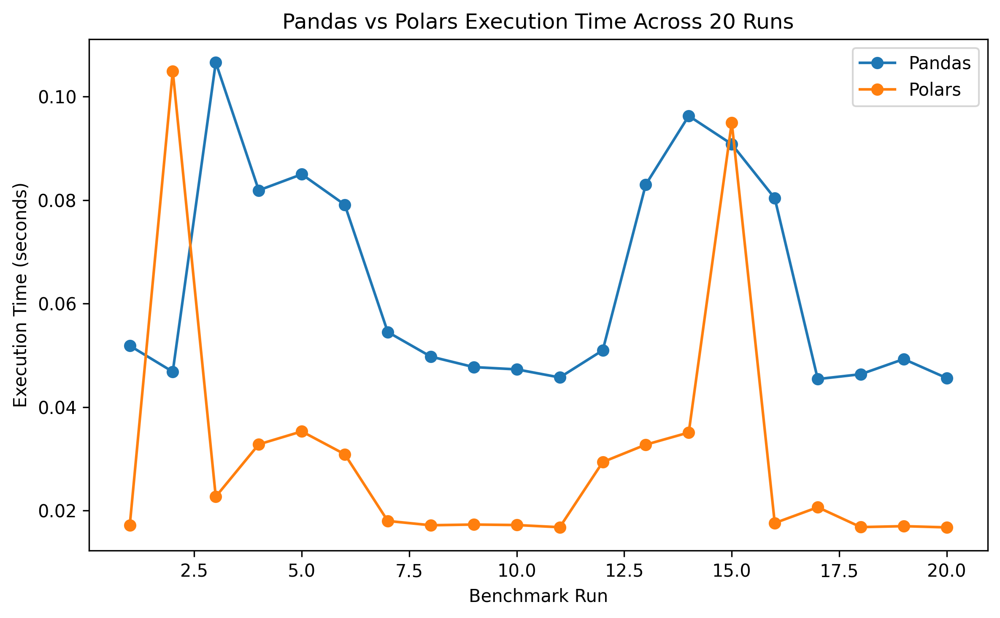

# Pandas vs Polars Performance Benchmark

A small reproducible benchmark comparing the execution performance of Pandas and Polars for grouped aggregation on a synthetic dataset containing one million rows.

## Objective

The purpose of this experiment was to compare the execution time of Pandas and Polars when performing the same grouped aggregation task.

Rather than relying on a single execution, the benchmark was repeated 20 times to reduce the influence of temporary runtime variation.

## Dataset

A synthetic dataset containing 1,000,000 rows was generated using NumPy.

The dataset included the following variables:

- `station_id`
- `temperature`
- `salinity`
- `ph`
- `dissolved_oxygen`

A fixed random seed was used to improve reproducibility.

The dataset was created specifically for this benchmark and does not contain real environmental observations.

## Benchmark Task

Both libraries performed the same operation:

1. Group records by `station_id`
2. Calculate the mean temperature
3. Calculate the mean salinity
4. Calculate the mean pH
5. Calculate the mean dissolved oxygen

The execution time of each operation was measured using Python's `time.perf_counter()`.

## Results

| Metric | Pandas | Polars |
| --- | ---: | ---: |
| Average execution time | 0.0617 s | 0.0335 s |
| Median execution time | 0.0600 s | 0.0297 s |
| Standard deviation | 0.0156 s | 0.0255 s |
| Number of runs | 20 | 20 |

Across the 20 benchmark runs, Polars completed the aggregation in an average of 0.0335 seconds compared with 0.0617 seconds for Pandas.

In this test environment, Polars was approximately **1.84 times faster on average**.

Using the median execution time, Polars was approximately **2.02 times faster**.

Pandas showed lower variability between runs, while Polars achieved the lower overall execution time.

## Why Repeated Runs Matter

The initial single benchmark produced a different result:

- Pandas: 0.1201 seconds
- Polars: 0.2235 seconds

That single run suggested Pandas was faster.

However, after repeating the benchmark 20 times, Polars showed substantially lower average and median execution times.

This demonstrates why performance comparisons should not rely on a single execution.

## Visualization

## Reproducing the Benchmark

The full analysis is available in:

`pandas_vs_polars_benchmark.ipynb`

To reproduce the results:

1. Open the notebook in Google Colab or Jupyter Notebook.
2. Install Polars if required.
3. Run all cells.
4. The notebook generates the synthetic dataset.
5. Pandas and Polars perform the same grouped aggregation.
6. The benchmark is repeated 20 times.
7. Individual execution times are saved to `benchmark_results.csv`.
8. Summary statistics are saved to `summary_results.csv`.

## Files

`pandas_vs_polars_benchmark.ipynb`  
Contains the complete benchmark code and analysis.

`benchmark_results.csv`  
Contains the execution time from each of the 20 benchmark runs.

`summary_results.csv`  
Contains the mean, median, and standard deviation for both libraries.

`pandas_vs_polars_runs.png`  
Visualizes execution time across all benchmark runs.

## Tools

- Python
- Pandas
- Polars
- NumPy
- Matplotlib
- Google Colab

## Limitations

This benchmark evaluates one specific aggregation task on one synthetic dataset.

Performance may change depending on:

- Dataset size
- Data types
- Hardware
- Memory availability
- Runtime environment
- Library versions
- Type of data-processing operation

The results therefore describe the performance observed in this experiment and should not be interpreted as evidence that one library is universally faster than the other.

## Author

PenguinLogic
